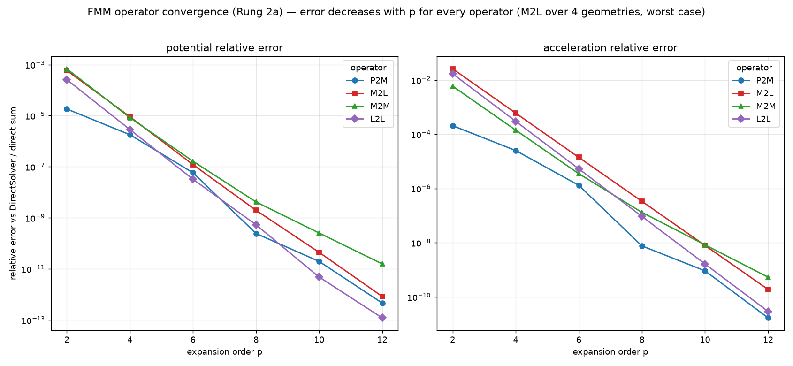
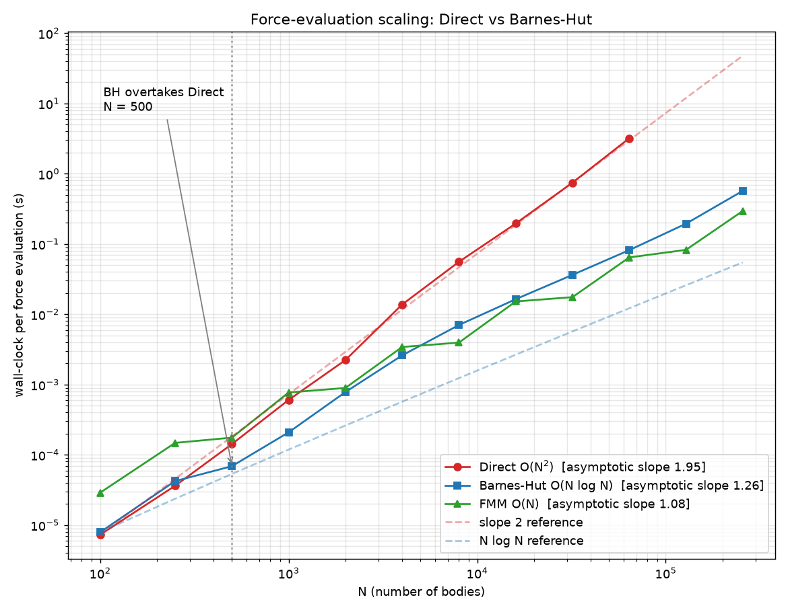
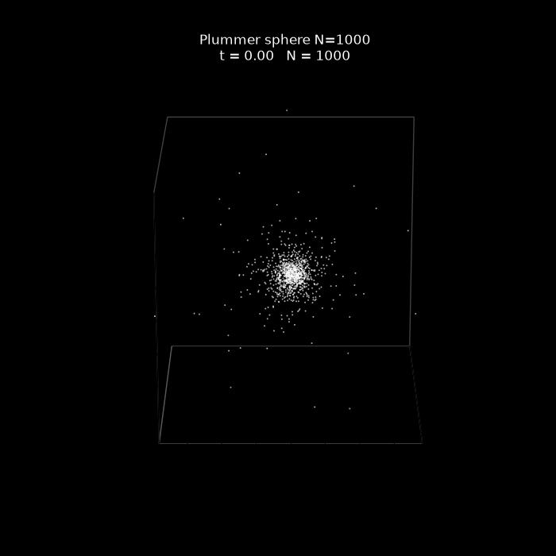
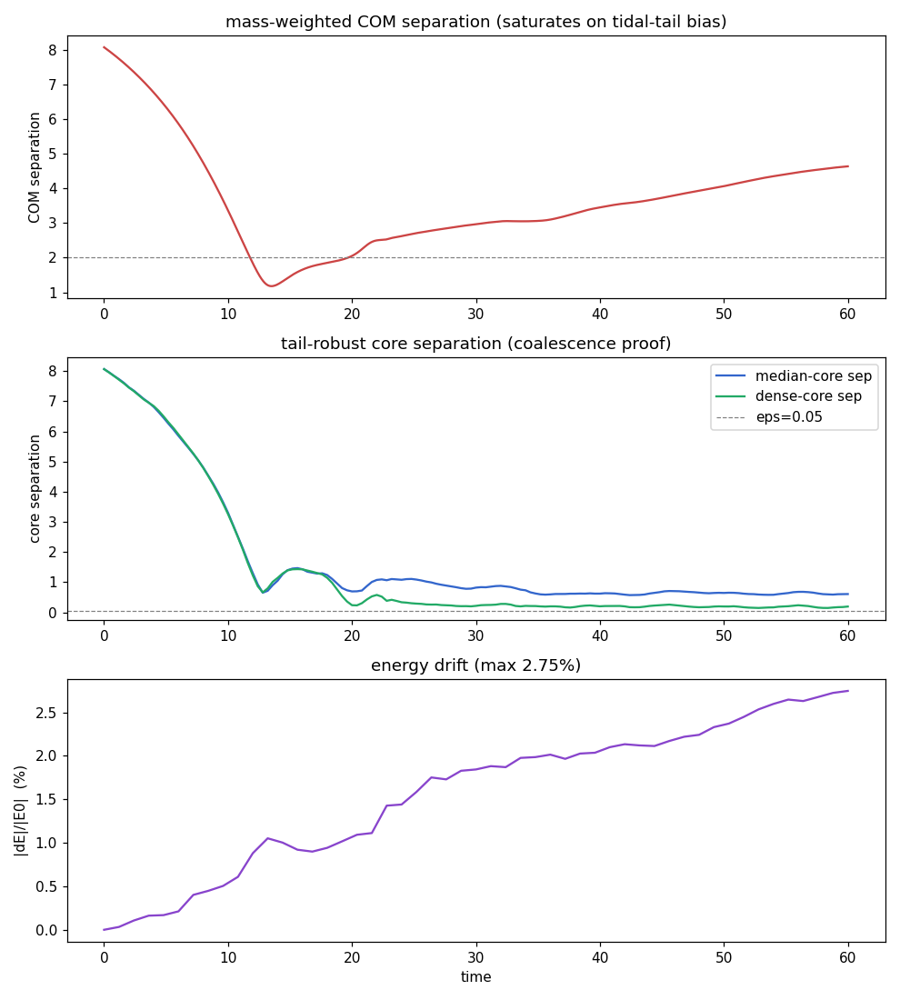
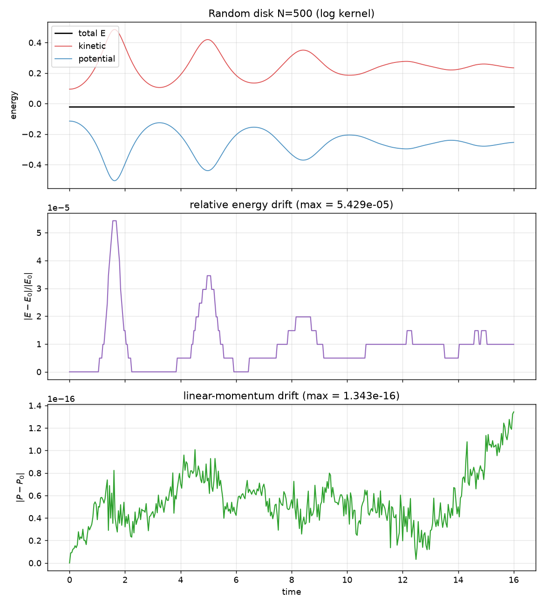

# An O(N) Galaxy

A gravitational N-body engine built around the Fast Multipole Method, a mathematical technique allowing us to simulate a million interacting bodies in **linear time**, written from scratch in 2D and 3D, on CPU and GPU. Demonstrated with the mathematically accurate collision of two galaxies, containing 1 million bodies total, simulated directly on GPU.

<div align="center">


*(Note: The simulation runs smoother and faster than this GIF can display due to browser limitations. For the true framerate, [view the raw MP4 video here](outputs/merger1m_coalesce.mp4).)*

</div>

## What this is

This is the full machinery for simulating how a huge number of masses move under their own gravity — and, more to the point, for doing it fast enough to be fun, using a cool algorithm that turns an impossible O(N²) problem into a merely hard O(N) one.

There are four force solvers here: a direct all-pairs solver (the slow, dead-simple, definitely-correct reference everything else gets measured against), a Barnes–Hut tree, a uniform-grid FMM, and an adaptive FMM. I wrote the FMM from scratch. Every one of its expansion operators (P2M, M2M, M2L, L2L, L2P) are hand-derived and have been tested individually, first in 2D with complex numbers, where the whole method is easiest to reason about, then in the full 3D spherical-harmonic version for 1/r² gravity. 

The 3D solvers run on the GPU via CUDA, which is how a million bodies fit on a laptop. 

On top is a galaxy toolkit: an initial-condition generator that builds disk-and-bulge galaxies sitting in *self-consistent equilibrium*, meaning every star is handed exactly the orbital speed that balances the gravity it actually feels, solved from the engine's own force field rather than guessed, so the galaxy doesn't instantly collapse or fling itself apart the moment you hit play. Plus, a symplectic integrator, collision choreography, an offline renderer and some more smaller stuff. Underneath all of this lies a validation harness that checks every fast solver against the exact one to roundoff. This is important because you can't eyeball whether dynamics at this scale are correct (or at any scale really), so nothing fast gets trusted here until it reproduces the brute-force answer to approximately fifteen digits.

## The method

Some would say that gravity is 'relentlessly social' - every body in a system pulls on every other. So one honest timestep means N² force calculations, around a trillion at a million bodies before you've drawn a single frame. The FMM (Greengard & Rokhlin, 1987, and yes, it's on the semi-official list of the twentieth century's top-ten algorithms) sidesteps that with an idea you've likely already used without noticing: in physics class when you compute Earth's pull you don't sum over every atom, you use its center of mass. Squint at a faraway cluster of stars and it stops being a thousand points and becomes one fuzzy blob, and a blob is much cheaper than a thousand discrete points.

The FMM is the rigorous version of this intuition. Each clump of stars gets boiled down to a [**multipole expansion**](https://en.wikipedia.org/wiki/Multipole_expansion), which is really just a sharpening series of descriptions: total mass first, then how lopsided the clump is, then how it's stretched, and so on. Keep one term and you've got the center-of-mass approximation everyone already knows, keep a few more and you can pin down a distant clump to ridiculous precision with a tiny handful of numbers. Organize space into a tree, summarize every faraway cell that way, and only ever compute the real star-by-star sum for the few 'nearby' neighbors. Far away you read the summary; up close you do the traditional math.

Now, truncate the expansion at order `p` and the error *falls off a cliff* exponentially in `p`, with no floor.


*RMS force error vs. expansion order `p` (log scale). Every `+2` in `p` knocks the error down by roughly a factor of ten, and it keeps plunging with no floor. The no-floor part is useful, because if I'd miscounted a single box somewhere in the bookkeeping, the error would slam into a wall it couldn't get past no matter how many terms I tried It doesn't, so we know bookkeeping is right.*

Add it all up and you're left with linear scaling, the project's namesake:


*Force-calculation time vs. number of bodies (log-log). Brute force climbs as O(N²) and eventually gives up; the FMM holds a slope of ~1 and just keeps going.*

## The adaptive core

Here's where it gets real. A uniform grid of equal cells is perfectly happy on evenly-spread matter and falls flat on its face on an actual galaxy, which is 99% empty space wrapped around a stupidly dense core. Carve space into equal boxes and that entire core lands in one or two of them, and the exact near-field sum *inside* a box scales as occupancy², so you've just reintroduced the brute force. On a clustered million bodies, the uniform tree's busiest cell ends up holding nearly all of them. Whoops!

The solution to this is the adaptive FMM (Carrier, Greengard & Rokhlin). This is the most difficult part of this project, easily. Basically, you split a box only when it's crowded, like a map that auto-zooms into cities and leaves the empty ocean as one big tile. Now every cell holds at most a fixed number of stars no matter how lumpy the universe gets. The price is that cells of wildly different sizes end up as neighbors, and keeping their intractions correct takes four separate lists — two of which I build as exact mirror images of each other, which kills double-counting and lets me skip the expecteds misery of balancing the tree.

<br>
*Clustered, galaxy-like data. The uniform tree's busiest cell grows with N and its cost explodes as O(N²), where the adaptive tree caps every cell.*

| N (clustered) | adaptive's worst cell | uniform's worst cell |
|---|---|---|
| 128,000 | 64 | 125,772 |
| 1,000,000 | 64 | 998,063 |

This discrepancy is the entire reason the namesake galaxy merger model holds a flat step time straight through the most violent, densest instant of the collision instead of seizing up — which is, of course, exactly the moment a galaxy collision gets interesting.

## The galaxy

Our scenario of interest features two disk-and-bulge galaxies in equilibrium, set on a decaying orbit and let go, running on the adaptive GPU FMM in fp32. They fall toward each other, fold into a single relaxed remnant. The same basic story as the Antennae galaxies, in miniature, on a gaming laptop. So so cool.

And because I got burned several times by renders that looked like mergers where the galaxies never actually merged properly, whether they merged is settled by a number:


*Separation of the two galactic nuclei over time. They fall in, graze, swing back with a shrinking apocenter, and settle into one.*

And the whole interaction stays physically correct, energy bounded from first approach through the cores merging:


*Total energy across the full run, held within a bound through the close passage and the coalescence. (It's not dead flat. See below, where I confess to ~2.7% drift.)*

It'll push to around four million bodies before disk space for the frames, of all things, becomes the bottleneck, but notably *not* compute.

## Known issues

That energy curve drifts about 2.7% over the merger. Energy drift is an easy way to track integrity for sims like this, because obviously, total energy should never change in real gravity, so any wandering means the simulation is somehow generating or leaking energy it shouldn't, which would artificially heat a galaxy up and puff it out. 2.7% is small and, crucially, *bounded* — it wobbles inside a band and does not spiral off.

I've made the diagnosis that this is caused by seam between the *softened* close-range force and the *pure* far-field expansions. Softening is the little fib you tell so two stars passing nearly on top of each other don't send the 1/r² force to infinity and blow up your timestep; the near field rounds that singularity off, while the far-field expansions don't bother, so they disagree about the energy they're conserving. The canonical fix is probably baking softening into the expansions themselves, which I haven't built. Two smaller issues, the uniform GPU solver face-plants on extremely clustered data (the adaptive one covers that case, so it's off the critical path), and on the CPU the FMM only wins asymptotically, not in raw wall-clock, until an O(p³) rotation trick I've firmly decided to implement later.

## Building it

You need C++17 and CMake. The GPU targets want CUDA 12+ and an NVIDIA card, but they're guarded in CMake, so the CPU solvers and the whole test suite build and run perfectly without any of that. Rendering needs Python with numpy, matplotlib, and ffmpeg.

```bash
cmake -S . -B build -DCMAKE_BUILD_TYPE=Release
cmake --build build -j

./build/adaptive_tests          # correctness, convergence, scaling (CPU, no GPU needed)
./build/adaptive_gpu_harness    # GPU vs CPU to roundoff + clustered O(N) (needs CUDA)

./build/galaxy_sim --solver fmm3d-adaptive --merger coalesce --n 1000000 \
    --ncrit 256 --eps 0.05 --dt 0.01 --out outputs/merger1m_coalesce
python tools/render_galaxy.py outputs/merger1m_coalesce --fps 30
```

Run anything with `--help` for its real flags.

## References

Greengard & Rokhlin 1987 (the FMM), Carrier, Greengard & Rokhlin 1988 (the adaptive version), Barnes & Hut 1986 (the O(N log N) tree), and Plummer 1911 (the softening kernel, 1911 was a good year for gravity!!).

MIT license.


## Outputs

The `outputs/` folder contains renders and data produced by the validation harnesses and runs. Below are the primary artifacts referenced in this README:

- Hero / coalescing run
    - `outputs/merger1m_coalesce.mp4` — coalescing million-body run (hero video)
    - `outputs/merger1m_coalesce.mp4` is linked from the header image above.
- Other runs and videos
    - `outputs/merger1m_adaptive.mp4`
    - `outputs/merger1m.mp4`
    - `outputs/merger.mp4`
    - `outputs/merger.mp4`
- Diagnostic images & GIFs
    - `outputs/coalesce_pass.png`
    - `outputs/coalesce_remnant.png`
    - `outputs/threed_cluster.gif`
    - `outputs/disk.gif`
    - `outputs/disk.mp4`
- Convergence & operator diagnostics
    - `outputs/fmm_convergence.png`
    - `outputs/fmm3d_convergence.png`
    - `outputs/fmm_operator_convergence.csv`
    - `outputs/fmm_error_vs_p.csv`
    - `outputs/fmm_gpu_error.csv`
- Performance & scaling
    - `outputs/scaling.png`
    - `outputs/scaling3d.png`
    - `outputs/scaling_gpu.png`
    - `outputs/fmm_gpu_scaling.csv`
    - `outputs/gpu_scaling.csv`
- Coalescence diagnostics & logs
    - `outputs/merge50k_dt01_diag.png`
    - `outputs/merge50k_dt01_energy.csv`
    - `outputs/merge50k_dt01_sep.csv`
    - `outputs/merger1m_coalesce_sep.csv`
    - `outputs/merger1m_coalesce_coresep.csv`
    - `outputs/merger1m_coalesce_run.log`

If you'd like additional files linked inline, or different thumbnails used for any section, tell me which files and I will update the README accordingly.